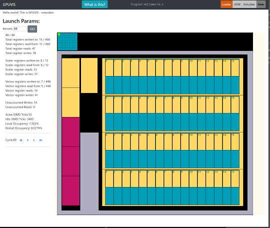

====== GPUVIS ======

Live demo: https://dooglz.github.io/gpuvis/

Code repo: https://github.com/dooglz/gpuvis

==== What is this? ====

It's a AMD GPU code analyser/simulator, written in javascript.

It works on GCN ISA, so it can accept anything(soon) that the AMD driver accepts (OpenCL, SprirV, vert/frag) [but not quite yet]

==== Can I help? ====

With code: sure. But it's not in a good state yet

With the research: __**Yes please!**__ 

I want to hear your feedback, and if possible work with you and your workflow to see how I can shape this tool to be as useful as possible to GPGPU programmers.

==== More Info ====

[Check my research wiki page]( https://www.student.soc.napier.ac.uk/~40082367/doku.php?id=research:gpuvis)

